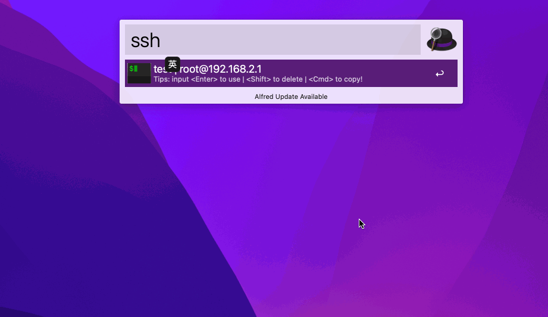

codezm.workflows.fcs-python
======================================

## 简介

这是一款由 `Python` 代码编写的 Alfred workflow 插件。用于实现 ssh、redis 服务器管理，借助 ssh、scp、redis-cli 客户端工具实现快速与服务端建立连接。

- **ssh** 管理服务器连接信息，快速与服务器建立连接。
- **scp** 基于服务器配置信息实现本机与服务器端文件互传。
- **redis** 管理 redis 服务器连接信息，快速与 redis 服务器建立连接。

## 使用

[点击下载 alfredworkflow](https://github.com/codezm/codezm.workflows.fcs-python/releases/download/v1.0.0/codezm.workflows.fcs-python.alfredworkflow)

### ssh

默认触发关键字 **ssh**, 可查看已添加服务器列表。

#### 新增服务器配置

新增服务器连接格式:

> ssh add service-name ip-address username password [root-password]
>
> 下面以创建服务名 `test`，主机 `127.0.0.1`，用户名：`cat`，密码：`12345`，root密码：`rootroot` 举例：
>
> ssh add test 127.0.0.1 cat 12345 rootroot

使用自定义 `ssh` 格式:

> ssh add test ssh -i ~/.ssh/id_rsa  -p 2222 cat@127.0.0.1

#### 管理服务器配置

在使用 ssh、redis 管理服务器配置时，可通过以下指令来管理

1. 按 `Enter` 打开终端并进入自动登录服务器
2. 按 `Shift + Enter` 删除服务器记录
3. 按 `Command+Enter` 复制服务器记录

### redis

#### 新增服务器配置

默认触发关键字 **redis**, 可查看已添加服务器列表。

新增 `redis` 服务连接格式：

> redis add service-name ip-address [port] [db] [password]
>
> 下面以创建服务名 `test`，主机 `127.0.0.1`，端口号 `6379`，数据库 `15`，密码 `testtest` 举例：
>
> redis add test 127.0.0.1 6379 15 testtest

使用自定义 `redis-cli` 格式:

> redis add service-name redis-cli ip-address -h ip-address -p port --pass password
>
> 下面以创建服务名 `test`，主机 `127.0.0.1`，端口号 `6379`，数据库 `15`，密码 `testtest` 举例：
>
> redis add test redis-cli -h 127.0.0.1 -p 6379 -n 15 --pass testtest

#### 管理服务器配置

详见 `ssh` 管理服务器配置。

### scp

> scp 指令使用 ssh 指令添加的服务器配置，添加、删除服务器配置可通过 ssh 指令完成。

默认触发关键字 **scp**, 可查看已添加服务器列表。

1. scp <输入要检索的服务器>。

2. 选择要互传文件的服务器，按 `Enter`  键。

3. 选择 `Download` 还是 `Upload`，按 `Enter` 键。

   > 要从服务器下载文件则选择 `Download`。
   >
   > 要上传文件至服务器则选择 `Upload`。

4. 输入：<服务器文件路径> `Space` <本地文件路径>。

   > ⚠️ 不管选择的是 `Download` 还是 `Upload` <服务器文件路径> 永远在第一个。
   >
   > 示例：
   >
   > scp test>>>Download>>>/etc/passwd ./

5. 按 `Enter` 键，执行文件互传操作。

### 其他问题
- 原始密码怎么不是原文？
终端使用的密码是经过 `base64` 编码过的，可通过 `echo "cm9vdHJvb3QK" | base64 --decode` 命令查看原始密码。
- 如何将 `iTerm` 设为默认 Terminal ？
参见 [custom-iterm-applescripts-for-alfred](https://github.com/stuartcryan/custom-iterm-applescripts-for-alfred)

